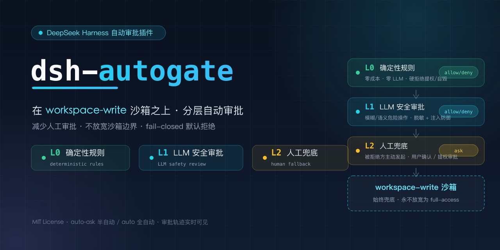
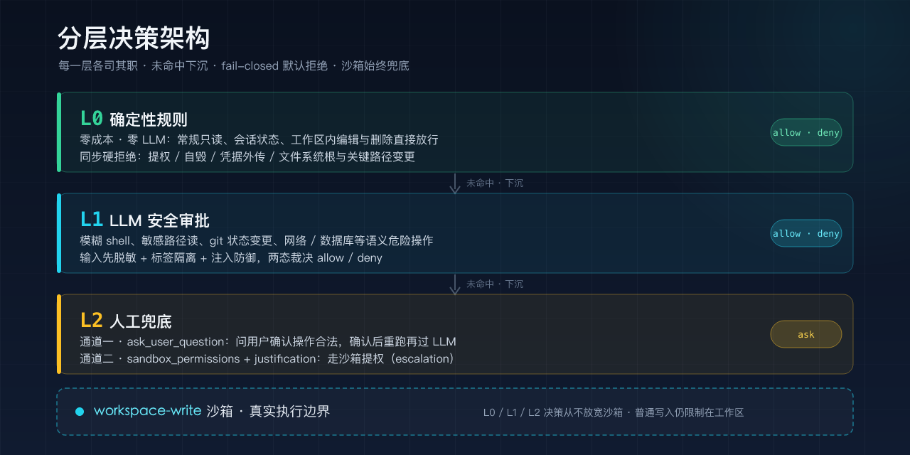
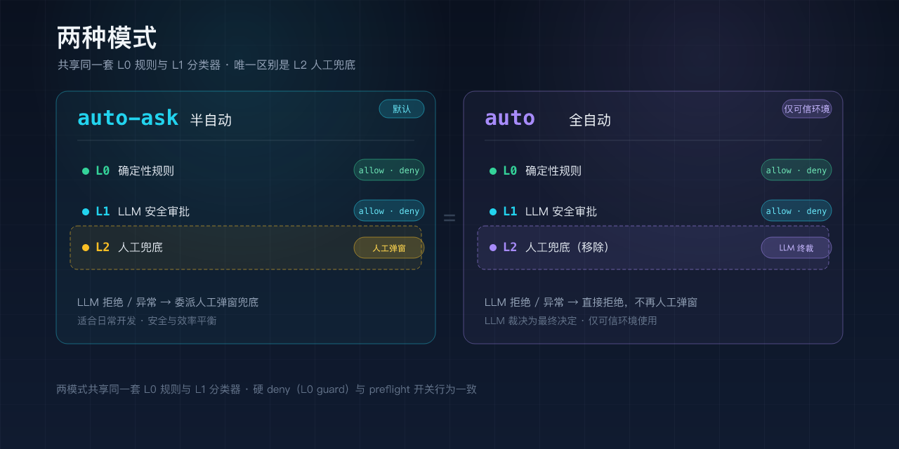
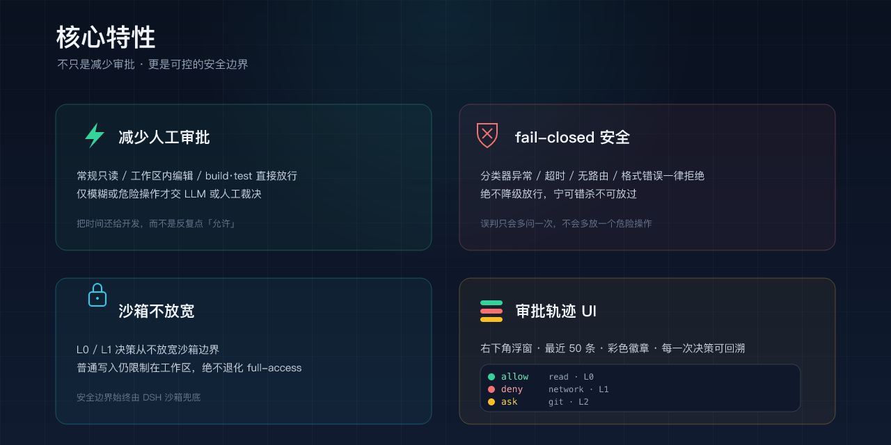

**语言：** 简体中文（本页） · [English](README.en.md)

# dsh-autogate

  

DeepSeek Harness 自动审批插件：在 **workspace-write 沙箱之上** 增加「半自动（auto-ask）+ 全自动（auto）」两档权限，采用「确定性规则 + LLM 安全审批 +（半自动下）被拒绝方主动人工审批」分层决策。保留工作区沙箱边界，不放宽为 full-access。

## 分层设计

| 层 | 决策 | 说明 |
| --- | --- | --- |
| L0 确定性规则 | allow / deny | 零成本、零 LLM：只读、会话状态、工作区内编辑与删除、build/test、run_code 容器直接放行；工作区外普通路径读直接放行；工作区外的写/删除（敏感 shell/凭据配置文件写除外）放行交由 workspace-write 沙箱拦截 + escalation 弹窗；工作区外敏感配置文件写交 LLM 审查；空命令、动态命令名、参数缺失等兜底放行交由沙箱；提权、系统级自毁（关机/重启/格式化；进程杀手 killall/pkill/taskkill/Stop-Process 降级 L1）、凭据外传、文件系统根与系统/凭据关键路径（/usr/local 除外）的变更/删除、家目录根删除硬拒绝；家目录根变更、DSH_HOME 与 /usr/local 的变更/删除走工作区外通用路径（沙箱 + escalation） |
| L1 LLM 安全审批 | allow / deny | 沙箱不拦截但语义危险的操作（未识别工具、模糊 shell、敏感路径读、动态目标、块设备、持久终端、git 状态变更、网络/数据库操作、进程管理（killall/pkill/taskkill/Stop-Process）、工作区内受保护路径写）交 LLM 两态裁决：用户明确授权的操作放行，减少人工批准。分类器输入先脱敏再标签隔离（`<untrusted>` 数据 vs `<user-authority>` 授权），并内置注入防御；用户用短指代（如「A」）回应 AI 方案列表时，AI 提议作为 `<proposal-context>` 仅用于消解指代、不作授权；agent 指令文件（AGENTS.md / CLAUDE.md / .dsh 等）按常规配置归类，用户明确授权即可编辑 |
| L2 人工审批 | ask | 审批弹窗前先过 LLM 预审：合理则直接批准不弹窗，危险/不确定才人工兜底。覆盖三类审批请求：① AI 用 ask_user_question 问用户确认操作合法，确认后重新执行再过 LLM；② AI 用 sandbox_permissions + justification 重试走 DSH 沙箱提权（escalation）；③ 工具/插件自身声明需要审批（pre-execute 返回 ask）的调用 |

  

## 两种模式

| 预设键 | 模式 | escalation 提权审批兜底 |
| --- | --- | --- |
| `auto-ask` | 半自动（默认） | LLM 拒绝/异常 → 委派人工弹窗（L2 兜底） |
| `auto` | 全自动 | LLM 拒绝/异常 → 直接拒绝，不人工弹窗（LLM 裁决为最终决定） |

两种模式共享同一套 L0 确定性规则与 L1 LLM 分类器，唯一区别是 **L2 人工兜底**：半自动保留人工弹窗，全自动把 LLM 裁决作为最终决定。硬 deny（L0 guard）与 `preflight` 开关在两种模式下行为一致。

### 子代理继承

子代理（subagent）创建时继承父会话的托管档：父会话处于 `auto-ask` 或 `auto` 时，子代理会话的权限档与父一致（DSH 默认给子代理 pin `approval=never` 且不写权限档事件，本插件补写继承标记并放开为 ask）。

- **权限档投影**：子代理会话补写 `permission/preset` 继承标记（`source: autogate`），UI 显示与父会话相同的 Auto 档，而非「工作区读写」；该标记只影响显示，不作为授权依据。
- **授权依据锚定顶层**：子代理触发的一切 L0/L1/L2 审批，其授权依据（最近的直接人类消息与问答授权）始终取沿 parentSession 链向上找到的顶层 Auto 会话，避免无直接人类消息的子代理会话被误当作授权来源。
- **子代理审批无人工兜底**：子代理的提权 / 工具 ask 请求由 LLM 终审，拒绝即拒绝、不转人工弹窗（子代理无可靠弹窗通道）。

  

## 与同类插件的关键区别

- **普通调用保持 workspace-write**：L0/L1 决策从不放宽沙箱，即使 L1 LLM 误判，普通文件写入仍被限制在工作区（不同于让每次调用都跑 danger-full-access 的同类插件）。**L2 escalation 通道是例外**：批准的提权会让那一次调用以请求的更宽沙箱运行——见安全免责声明。
- **未识别工具默认走 LLM 分类而非放行**：但 `run_code` 作为代码执行容器直接放行——它内部的每次工具调用仍各自经过本策略与沙箱评估。
- **fail-closed**：分类器异常 / 超时 / 无路由 / 格式错误一律拒绝，由被拒绝方（AI）视情况主动向用户发起人工审批。

  

## ⚠️ 安全免责声明

本插件是「减少人工审批的决策层，**不是安全边界**」。真正的执行边界仍是 DSH 的 workspace-write 沙箱及其提权审批。

- L1 LLM 分类器是启发式的，可能误判（放行危险操作或拒绝安全操作）。fail-closed 减少误放行，但无法消除。
- 提示词注入防御（脱敏 + `<untrusted>`/`<user-authority>` 标签隔离 + anti-injection 条款）是软防御，可抬高注入门槛但无法彻底消除；硬保证仍靠 L0 确定性规则与 workspace-write 沙箱兜底。
- 静态路径检查（含 symlink realpath 加固）仍存在 TOCTOU 窗口：符号链接可能在检查通过后、写入前被重新指向。
- **全自动（`auto`）模式**下 LLM 裁决为最终决定、不再人工弹窗——仅在可信环境使用。
- 你对每一次被批准操作的最终效果负责。请查看审批轨迹，存疑时优先使用半自动（`auto-ask`）。
- **L2 escalation 路径是一次性放宽**：LLM 批准沙箱提权后，那一次调用以请求的更宽沙箱（通常 full-access）运行，而非 workspace-write。它不影响其他调用，但确实是一次真实的临时扩权——不要把「沙箱保持 workspace-write」理解为覆盖提权。

## 安装

    # 从 GitHub 安装（编译产物 lib/ 已随仓库提交）
    dsh plugin --profile web add github:wangxing-git/dsh-autogate
    # 或当 dsh 不在 PATH 中时：
    npx @deepseek-ai/dsh plugin --profile web add github:wangxing-git/dsh-autogate

    # 重启 dsh

## 配置

配置经 DSH settings 服务（`ctx.settings`）接入：在 `$DSH_HOME/settings.yaml` 写 `autogate:` 段即时热重载；未挂载 settings 服务时回退 `cordis.patch.yml` 的 entry config（`config: {}`）。

> **关于设置 UI**：DSH 0.1.0-rc.7 已移除 rc.6 对第三方插件 namespace 的硬编码 allowlist（`WEB_SETTINGS_NAMESPACES`），并支持插件经 keyed slot（`settings.plugin.item`，`key` 即 namespace）自行注册设置卡片。本插件的设置卡读写走 DSH 官方客户端 settings API（`ctx.connection.api.settings` 的 `describe` / `mutate`，批量 `mutate` 保留跨字段约束如 provider/model 成对的原子性）；审批轨迹面板仍经自有 `/autogate` RPC 端点（`trail`）拉取。写入落在 `$DSH_HOME/settings.yaml` 的 `autogate:` 段并热重载，与下方手动配置完全一致。

    autogate:
      preflight: false                 # 沙盒前拦截判断开关：true 执行确定性规则+LLM 分类，false（默认）完全依赖沙盒
      showTrail: true                  # 审批轨迹浮窗开关：false 隐藏右下角浮窗并停止轮询轨迹接口（默认显示）
      presetName: auto-ask             # 半自动模式预设键（默认 auto-ask）：LLM 拒绝后转人工兜底弹窗
      fullAutoPresetName: auto         # 全自动模式预设键（默认 auto）：LLM 裁决为最终决定，不再人工弹窗
      classifierTimeoutMs: 8000        # 分类器超时（100–60000ms），超时 fail-closed
      classifierMaxOutputTokens: 1024  # 分类器输出上限（64–4096）
      classifierRetry: true            # 分类器输出解析失败时静默重试一次（默认开启）
      # 提案上下文（proposal-context）预算：短指代消息（如「A」「继续」）消解指代时附带的 AI 提议上下文限界
      # proposalContextMaxMessageLen: 10   # 消息长度阈值（字符）：≤该值才携带上下文（1–200）
      # proposalContextMaxChars: 400       # 单条上下文上限（64–4000）
      # proposalContextMaxTotalChars: 2000 # 上下文总预算（64–8000）
      # classifierPrompt: |              # 审查（分类）系统提示词，留空用内置默认
      #   （自定义审查提示词，按目标/类型/可逆性/影响判断）
      # 固定分类模型（默认复用当前会话的 provider/model；两字段须成对）
      # classifierProvider: deepseek
      # classifierModel: deepseek-chat
      # 独立 OpenAI 兼容分类端点（可选；必须 HTTPS，loopback 可用 http）
      # classifierEndpoint: https://api.example.com/v1/chat/completions
      # classifierApiKeyEnv: DEEPSEEK_API_KEY   # HTTP 端点 API Key 的环境变量名
      # classifierHttpDisableReasoning: true    # HTTP 分类请求显式关闭思考模式（reasoning_effort=none，默认开启）；
      #                                         # OpenAI 官方端点支持；不认识的兼容端点（如 DeepSeek 官方 API）报 400 时设为 false
      # workspaceRoot: /path/to/ws              # 覆盖工作区根目录（默认会话 cwd）
      # tempRoots: [/tmp]                       # 信任的临时目录（默认系统临时目录）

## 决策流程

> **`preflight` 开关（默认 `false`）**：控制是否在沙盒前执行「普通确定性规则 + LLM 分类」两步拦截。设为 `false` 时跳过下述第 3、4 步，工具调用直接进入 workspace-write 沙盒（完全依赖沙盒策略）；第 2 步硬 deny 与第 5 步审批请求预审（escalation 提权 + 工具自身 ask）始终生效，不受开关影响。设为 `true` 恢复完整的沙盒前拦截判断。

1. 非 Auto 会话：原样放行，不改变官方行为。
2. Auto 会话：同步硬 deny（提权、自毁、凭据外传、文件系统根与系统/凭据关键路径的变更/删除、家目录根删除）→ 无法被后续监听器或 LLM 覆盖；家目录根变更与 DSH_HOME 的变更/删除走工作区外通用路径（沙箱拦截 + escalation 审批）。
3. 确定性 allow（只读、会话状态、工作区内编辑与删除、只读 shell、build/test、版本探测、run_code 容器；工作区外普通路径读直接放行；工作区外写/删除（敏感 shell/凭据配置文件写除外）放行交由 workspace-write 沙箱拦截 + escalation，工作区外敏感配置文件写交 LLM 审查；空命令、动态命令名、参数缺失等兜底放行交由沙箱）。
4. 沙箱不拦截但语义危险的操作（模糊 shell、敏感路径读、动态目标、块设备、持久终端、git 状态变更、网络/数据库、工作区内受保护路径写）→ LLM 两态裁决（allow / deny）。
5. 审批请求统一先过 LLM 预审（**仅半自动 `auto-ask` 模式保留人工兜底**）：
   a. AI 用 ask_user_question 问用户确认操作合法，用户确认后重新执行，再过 LLM 审批放行；
   b. 用 bash/pwsh 的 sandbox_permissions + justification 重试，走 DSH 内建沙箱提权（escalation）——合理越界（用户明确授权）直接批准不弹窗，且那一次调用随后以请求的更宽沙箱（通常 full-access）运行；危险/不确定才人工弹窗；
   c. 工具/插件自身声明需要审批（pre-execute 返回 ask）的调用——本插件同样先过 LLM 判断：合理直接批准不弹窗，危险/不确定才人工弹窗。

   **全自动 `auto` 模式**：审批请求（escalation 提权 + 工具自身 ask）由 LLM 裁决为最终决定——allow 直接批准，deny / 分类器异常直接拒绝，不再人工弹窗。

## 审批轨迹 UI

插件生效时，DSH Web 界面右下角会出现一个悬浮的「审批轨迹」开关（注入 `shell.overlay` 槽位），仅当存在审批记录时显示。

- 开关显示当前记录数、最近一条记录的决策色圆点与放行/拒绝/转人工计数，可展开/收起面板。
- 面板列出**最近 50 条**记录（轨迹本身是进程级环形缓冲，上限 200 条，面板只显示最新一段）。
- 面板按**当前会话隔离**：只显示当前选中会话产生的审批记录——主会话窗口能看到其授权（含子代理触发）的全部审批，子会话窗口也能看到自己执行的审批；可点范围按钮临时切到「查看全部」，未选中会话时默认显示全部记录（切换为临时状态，刷新页面后回到当前会话隔离）。
- 每条记录用彩色徽章标识决策结果（绿色 = 放行、红色 = 拒绝、橙色 = 转人工），配层级徽章（`L0` 确定性 / `L1` LLM / `L2` 人工）、工具名（等宽字体）与本地时间；折叠态仍显示一行操作摘要预览。
- 展开单条记录可查看操作摘要、拒绝/放行理由、工具 `callId`、本地时间与决策耗时。
- 「定位」按钮把会话视图滚动到对应的那次工具调用。
- 数据每 2 秒从插件 `trail` RPC 轮询一次（拉取失败保留上一份快照）。
- 浮窗可通过配置 `showTrail: false`（或设置卡）关闭：面板隐藏且客户端停止轮询 `trail` RPC；服务端轨迹照常记录。
- 轨迹为进程级、仅内存保存：dsh 重启即清空，从不持久化。
- 拒绝/放行理由跟随 DSH 设置语言（zh/en）：显式设置 `en` 时理由为英文，否则（含未显式设置）回退中文，与界面语言保持一致。

## 目录结构

    src/
      index.ts         入口：guard + tools/pre-execute 两态判定 + 提权重试放行 + 审批轨迹 RPC
      policy.ts        工具级确定性规则（L0）与危险识别
      shell.ts         bash/pwsh 静态分析（L0 硬 deny + 危险 shell 识别）
      classifier.ts    LLM 分类器（DSH 内部 LLM / 可选 HTTP 端点）+ 脱敏 + 标签隔离 + 注入防御 + 系统提示词
      paths.ts         路径规范化、危险路径判定、工作区根解析
      trail.ts         审批轨迹（进程级环形缓冲，只增不持久化）
      types.ts         共享类型
      client.tsx       设置 UI 卡片 + 审批轨迹面板（客户端 bundle）
      client-logic.ts  客户端 UI 逻辑（官方 settings API 数据源 / 表单控制器 / 审批轨迹控制器 / i18n 文案）
    tests/             测试（paths / shell / policy / classifier / trail / settings / client-logic / index）
    scripts/
      build-client.mjs     客户端 bundle 构建脚本
      fix-session-zstd.py  会话 zstd 修复脚本
    cordis.patch.yml   权限预设表（插入 auto-ask 半自动 + auto 全自动档，sandbox=workspace-write）
    lib/                编译产物（由 build 生成并纳入版本控制，勿手改）

## 已知限制

- 路径包含判定基于真实身份（最深存在祖先经 realpath 解析），工作区内 symlink 不再绕过 L0/L1 分类；残余的 TOCTOU 窗口是「检查通过后、写入前」被重新指向的 symlink，仍由 workspace-write 沙箱兜底。
- 删除工作区内文件直接放行，依赖 workspace-write 沙箱兜底；不做会话产物 artifact 追踪，工作区外的删除同样放行交由沙箱拦截 + escalation。
- 分类器默认复用当前会话模型；若会话使用第三方 provider，分类请求会发往该 provider（已脱敏、限界）。
- `preflight` 开关默认 `false`：普通工具调用完全依赖 workspace-write 沙箱，默认只跑硬 deny guard 与 escalation 预审；设 `preflight: true` 才会对每次调用加确定性规则 + LLM 分类。
- 凭据外传检测按「命令位置」识别网络命令：外发私钥 / 云凭据等敏感文件引用（`.ssh/`、`id_rsa`、`.credentials.yaml` 等）无条件硬 deny（含回环目标）；PASSWORD / TOKEN / *KEY 等文本标记仅在外部目标时硬 deny，全部 URL 目标为本机回环地址（localhost 及其子域、127/8、`[::1]`、`0.0.0.0`）时豁免、交 L1 语义审查（如本机登录 API 测试），目标不可判定（变量展开 / 无 URL）时 fail-closed 拒绝。仍无法识别 base64 编码或分段的凭据；把它当作绊线，而非保证。
- heredoc 正文中的命令行仍按命令段处理：用 bash heredoc 写入含网络命令与敏感字样的脚本文件可能被误拦（建议改用 write 工具写文件）。
- 工具级凭据外发检测（web_fetch/web_search/curl/wget 前缀工具与外部写工具）按「真实凭据形态」判定：Bearer 值长度 >= 20 且含数字或符号、sk-/ghp-/github_pat/xox* 前缀 token >= 12 字符且含数字；query/body 等自然语言字段里「Bearer + 英文单词」不再误拦。纯字母长 token 可能漏检（交 L1 语义审查与沙箱兜底）。
- 进程杀手（killall/pkill/taskkill/Stop-Process）已降级 L1：L1 误判放行杀掉宿主进程的后果是会话崩溃（可恢复，非不可逆破坏），且 kill <pid> 与复合写法本就交 L1，全量 L0 的边际防护有限；系统级破坏（关机/重启/格式化）仍硬 deny。
- /usr/local 从系统关键路径豁免，走「沙箱拦截 + escalation 人工审批」通道（与家目录根变更同模式）：PATH 前置的 /usr/local/bin 覆盖是持久化劫持向量，由 escalation 弹窗人工对冲；/usr 本体与 /etc 等仍硬 deny。
- 分类器的注入防御是提示词级软约束（脱敏 + 标签隔离 + anti-injection），对抗性注入仍可能诱导误判；危险操作的最终拦截依赖 L0 硬 deny 与 workspace-write 沙箱。

## License

MIT
